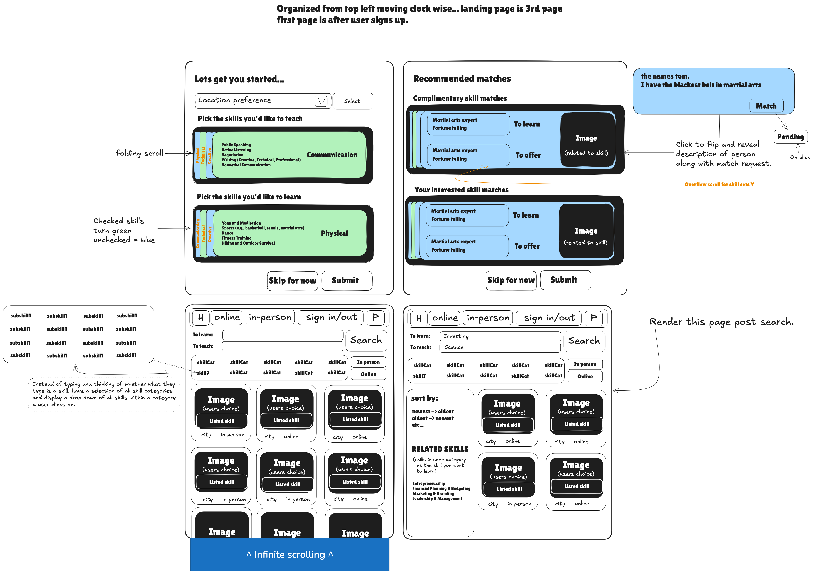

# Skill Swap
## User stories
    - As a user I want to be able to browse the website without having an account so that I can skip the hassle of signing up.
    - As  a user I want to be able view profiles based on a relationship between there learn and my teach and vice cersa
    -As a user if no results are a match in a search I want profiles dislaying similar (same category) skills to my search to be rendered so that I don't have to keep searching untill my search input hits.
    - As a user I would like to be able to edit my profile so that I can update my skill preference.
    - As a user I want to be able to search for skills via a drop-down as an alternative to typing the skill to eliminate the thought process of "what is a skill".
## Acceptance criteria
    - ✅ Features 2 buttons beside the search bar to toggle between 'to learn' or 'to teach' if none are selected then return all results that match the search.
    - ✅ Display profiles with profile picture (anything), The main skill they will teach, meeting preference(online, face 2 face), and their city.
    - ✅ If there are no matches to the users search display 'no results' and render related skills on the side bar that WILL produce results.
    - ✅ Features a drop down containing all possible skills. (Render all skill categories only and reveal all sub-skills in that category once clicked)
    - ✅ Features filter options that may filter by newest to oldest skills and vice versa, meeting arrangements (in person or online).s
## This is an idea of what I will build
